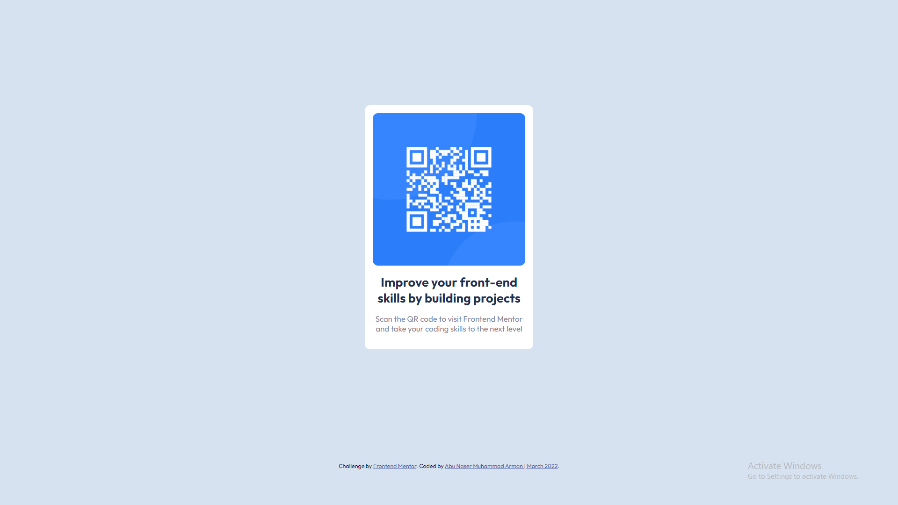

# As Salamu Alaikum! 👋 

This is my solution to the [QR code component challenge on Frontend Mentor](https://www.frontendmentor.io/challenges/qr-code-component-iux_sIO_H). To view the live site [Click Here](https://arman-anm.github.io/qr-code-component-main/).

## Table of contents

- [As Salamu Alaikum! 👋](#as-salamu-alaikum-)
  - [Table of contents](#table-of-contents)
  - [Overview](#overview)
    - [Screenshot](#screenshot)
    - [Links](#links)
    - [Built with](#built-with)
    - [What I learned](#what-i-learned)
    - [Useful resources](#useful-resources)
  - [Get Connected](#get-connected)
## Overview
I've embarked this challenge to brush-up my HTML & CSS skills.

### Screenshot

 

### Links

-  [Live Site](https://arman-anm.github.io/qr-code-component-main/)
-  [Solution](https://www.frontendmentor.io/solutions/qr-code-component-challenge-using-html-and-css-STiO-43zm)
 
### Built with

- Semantic HTML5 markup
- CSS custom properties
- Flexbox (to center the card)
- Mobile-first workflow

### What I learned
- Centering an element in HTML is freaking hard for me. There must be something wrong, everytime😏

This time, luckily it worked😇😇

```css
  display: flex;
  flex-direction: column;
  min-height: 90vh; /* Without height property the card won't align horizontally */
  justify-content: center;
  align-items: center;
```

### Useful resources

- [Outfit Font](https://fonts.google.com/specimen/Outfit) - Used this font in this project.

## Get Connected 

- Facebook - [Abu Naser Muhammad Arman](https://www.facebook.com/armaan.anm)
- Instagram - [@arman_anm](https://www.instagram.com/arman_anm/)
- Twitter - [@arman_anm](https://twitter.com/arman_anm)
- Gmail - <armaan.anm@gmail.com>